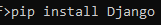

# EstoqueWeb

Este é um projeto desenvolvido durante o terceiro período do curso de **Sistemas de Informação**. O **EstoqueWeb** é um sistema de gerenciamento de estoque básico, desenvolvido com o framework web **Django**, utilizando a linguagem **Python**.

## Tecnologias Utilizadas
- **Django**: Framework web escrito em Python.
- **Python**: Linguagem de programação.

## Pré-requisitos
Antes de começar, você precisará ter o **Python** instalado em sua máquina. Para verificar se o Python está instalado, execute:

Se não estiver instalado, você pode baixá-lo no [site oficial](https://www.python.org/).

Além disso, será necessário instalar o **Django**. Para instalar, execute o seguinte comando no terminal:

## Configuração do Ambiente Virtual
É recomendado o uso de um ambiente virtual para isolar as dependências do projeto. Para criar um ambiente virtual, execute o seguinte comando:

Ative o ambiente virtual:

  

## Rodando o Projeto
Com o Django instalado e o ambiente virtual ativado, execute o seguinte comando no terminal para iniciar o servidor local:

Se tudo estiver correto, o projeto estará rodando em [http://localhost:8000](http://localhost:8000).

## Divirta-se!
Agora, você pode explorar e testar o sistema de gerenciamento de estoque no navegador.
